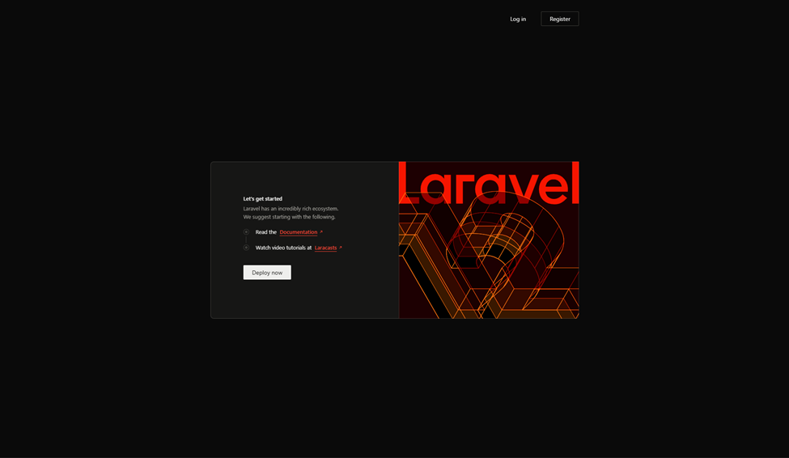
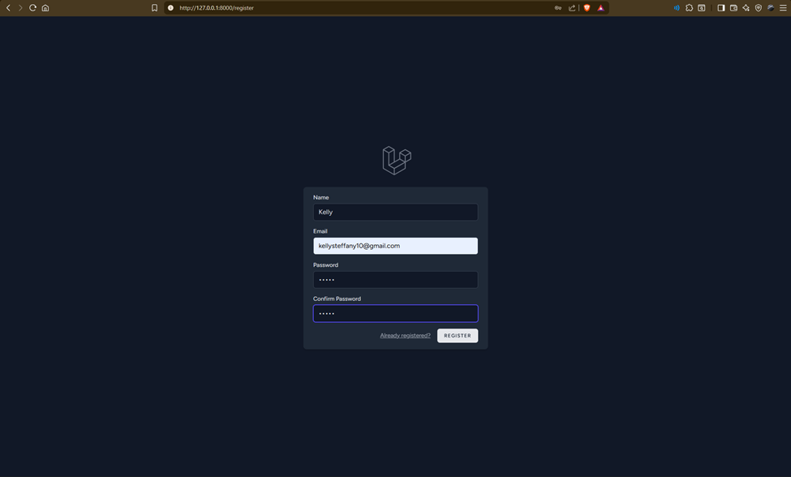
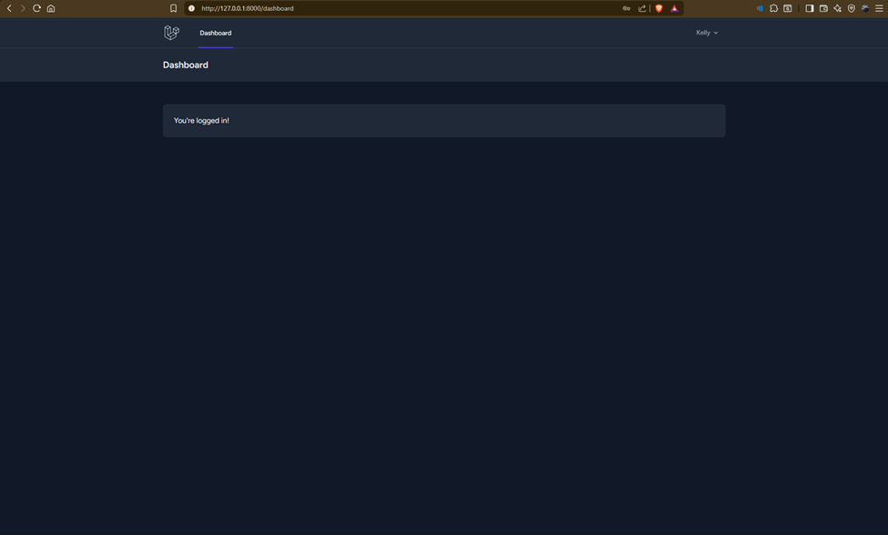
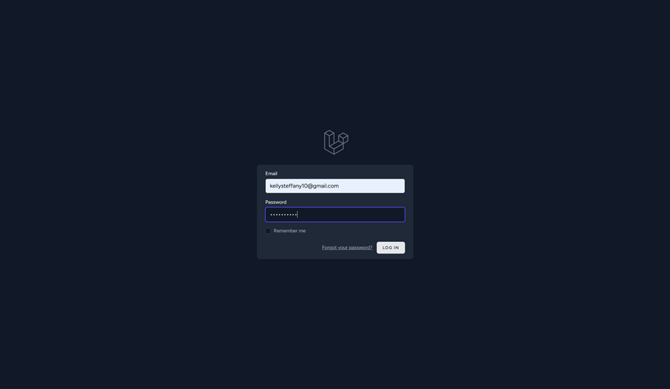

# 📚 Laboratorio: Sistema de Autenticación en Laravel

**Estudiante:** Kelly Beitia  
**Cédula:** 8-1023-152  
**Institución:** Universidad Tecnológica de Panamá  
**Materia:** Desarrollo de Software VII  

---

## Introducción

El objetivo principal de esta práctica es la configuración de un entorno de desarrollo profesional basado en el framework Laravel, integrando un sistema de autenticación robusto mediante Breeze. Se busca comprender la interacción entre el servidor web, el motor de plantillas y la base de datos, asegurando que el flujo de trabajo cumpla con los estándares modernos de desarrollo web.


## Arquitectura MVC en Laravel
Laravel implementa el patrón de arquitectura Modelo-Vista-Controlador (MVC), el cual organiza el código en tres componentes principales para facilitar su mantenimiento y escalabilidad:

Modelos (app/Models): Representan la estructura de los datos. Son los encargados de interactuar con la base de datos mediante Eloquent ORM. Por ejemplo, el modelo User.php gestiona toda la información de los usuarios registrados.

Vistas (resources/views): Es la capa de presentación. Utilizan el motor de plantillas Blade para generar el HTML que el usuario ve en su navegador. Aquí se encuentran los formularios de login y registro generados por Breeze.

Controladores (app/Http/Controllers): Actúan como el "cerebro" o intermediario. Reciben las solicitudes del usuario (a través de las rutas), procesan la lógica necesaria (consultando al modelo) y devuelven la respuesta adecuada (cargando una vista).

Rutas (routes/web.php y routes/auth.php): Son las encargadas de definir las URLs de la aplicación. Mapean cada dirección web (ej. /login) con una función específica dentro de un controlador.

---

## Requisitos del Sistema

Para la ejecución de este proyecto es necesario contar con:

- PHP: v8.0 o superior  
- Composer: Última versión estable  
- Servidor Local: XAMPP / Laragon (Apache & MySQL)  
- Node.js & NPM: Para la compilación de estilos con Vite  
- Editor: Visual Studio Code  

---

## 🧩 2. Crear el proyecto

```bash
laravel new ejemplo
```

```bash
 ██╗       █████╗  ██████╗   █████╗  ██╗   ██╗ ███████╗ ██╗
 ██║      ██╔══██╗ ██╔══██╗ ██╔══██╗ ██║   ██║ ██╔════╝ ██║
 ██║      ███████║ ██████╔╝ ███████║ ██║   ██║ █████╗   ██║
 ██║      ██╔══██║ ██╔══██╗ ██╔══██║ ╚██╗ ██╔╝ ██╔══╝   ██║
 ███████╗ ██║  ██║ ██║  ██║ ██║  ██║  ╚████╔╝  ███████╗ ███████╗
 ╚══════╝ ╚═╝  ╚═╝ ╚═╝  ╚═╝ ╚═╝  ╚═╝   ╚═══╝   ╚══════╝ ╚══════╝

 Which starter kit would you like to install? [None]:
  [none    ] None
  [react   ] React
  [svelte  ] Svelte
  [vue     ] Vue
  [livewire] Livewire
 > none


 Which testing framework do you prefer? [Pest]:
  [0] Pest
  [1] PHPUnit
 > 1


 Do you want to install Laravel Boost to improve AI assisted coding? (yes/no) [yes]:
 > no

```

Despues que se instale y cree el proyecto nos preguntara que base de datos usaremos

```bash
 Which database will your application use? [SQLite]:
  [sqlite ] SQLite
  [mysql  ] MySQL
  [mariadb] MariaDB
  [pgsql  ] PostgreSQL (Missing PDO extension)
  [sqlsrv ] SQL Server (Missing PDO extension)
 > mysql


 Default database updated. Would you like to run the default database migrations? (yes/no) [yes]:
 > yes


   INFO  Nothing to migrate.


 Would you like to run npm install --ignore-scripts and npm run build? (yes/no) [yes]:
 > yes
```

Despues nos movemos a la carpeta del proyecto y ejecutamos el proyecto para ver que todo este funcionando

```bash
cd ejemplo
composer run dev
```

---

## Instalación de Breeze 

Laravel Breeze es una implementación mínima y simple de todas las funciones de autenticación de Laravel.

```bash
composer require laravel/breeze --dev
```

Luego, ejecuta el comando de instalación para configurar las vistas y rutas:

```bash
php artisan breeze:install
```
Luego seleccionamos la siguiente configuración

```bash
  Which Breeze stack would you like to install?
  Blade with Alpine ............................................................................................ blade
  Livewire (Volt Class API) with Alpine ..................................................................... livewire
  Livewire (Volt Functional API) with Alpine ..................................................... livewire-functional
  React with Inertia ........................................................................................... react
  Vue with Inertia ............................................................................................... vue
  API only ....................................................................................................... api
❯ blade

  Would you like dark mode support? (yes/no) [no]
❯ yes

  Which testing framework do you prefer? [Pest]
  Pest ............................................................................................................. 0
  PHPUnit .......................................................................................................... 1
❯ 1
```
---

## Instalar y Compilar Frontend

Este paso es crucial para que el diseño (CSS) se vea correctamente.

```bash
npm install
npm run dev
```

---

## Base de Datos y Migraciones

Antes de migrar, asegúrarse de configurar tu archivo `.env` con el nombre de la base de datos:

```env
DB_CONNECTION=mysql
DB_HOST=127.0.0.1
DB_PORT=3306
DB_DATABASE=ejemplo
DB_USERNAME=root
DB_PASSWORD=
```

### Problema común

Si al intentar registrarte aparece el error:

- `Table 'users' doesn't exist`
- o el mensaje `"Nothing to migrate"`

Significa que las tablas no se han creado.

### Solución (Migración Forzada)

Este comando borra las tablas existentes y las crea desde cero:

```bash
php artisan migrate:fresh
```

---

## Levantar el Servidor y Probar

```bash
php artisan serve
```

Abrir en el navegador:  
http://127.0.0.1:8000

### Funcionalidades:

- **Registrar usuario:** Ir al enlace *Register* en la esquina superior derecha  
- **Iniciar sesión:** Redirige automáticamente al Dashboard  
- **Cerrar sesión:** Desde el menú del perfil (Logout)  

---

## Arquitectura MVC en este proyecto

- **Modelos:** `app/Models/User.php`  
  - Define la estructura del usuario  

- **Controladores:** `app/Http/Controllers/Auth`  
  - Contiene la lógica de autenticación  

- **Vistas:** `resources/views/auth`  
  - Formularios `.blade.php` de Login y Registro  

- **Rutas:** `routes/auth.php`  
  - Gestión de URLs de acceso  

---

## Resultado Final

- Registro funcional con validación de datos  
- Login seguro    









---

## Dificultades Encontradas

- **Políticas de Ejecución:**  
  Se habilitaron scripts en PowerShell:
  ```bash
  Set-ExecutionPolicy
  ```

- **Rutas de Disco:**  
  Se corrigieron errores moviendo el proyecto de la unidad `K:` a `C:`  

---

## Fuentes Bibliograficas

  Irina Fong. (2025, September 4). Login Laravel - Instalación. YouTube. https://www.youtube.com/watch?v=GZMGyYNq3hE

  ‌Installation | Laravel 13.x - The clean stack for Artisans and agents. (2026). Laravel. https://laravel.com/docs/13.x/installation

  ‌Tarea Completo. (2022, May 24). ✅COMO INSTALAR COMPOSER EN WINDOWS PASO A PASO - FÁCIL Y RÁPIDO. YouTube. https://www.youtube.com/watch?v=yp04wvbAJPs

---

Este laboratorio ha sido desarrollado por el estudiante de la Universidad Tecnológica de Panamá:

Nombre: Kelly Beitia

Correo: kellysteffany10@gmail.com

Curso: Desarrollo de Software VII

Instructor del Laboratorio: Irina Fong